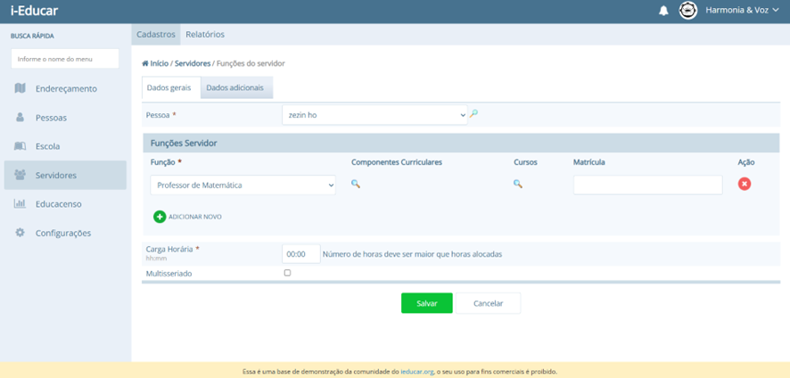
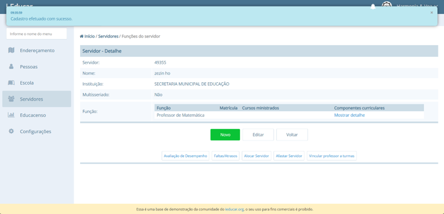
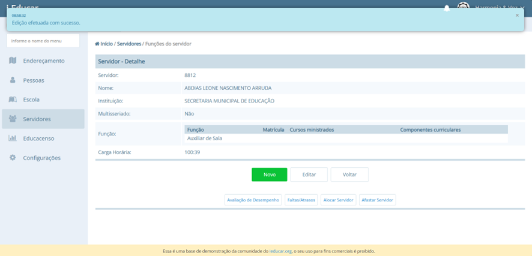

# Relatório de Falhas

**Sistema:** i-Educar – Gestão Escolar Pública  
**Funcionalidade:** Cadastro de Servidores/Professores  
**Autora:** Júlia Takaki Neves  
**Turma:** FGA0238 – 2025.1  

---

## Falha 1 — Carga Horária 00:00

**Descrição:**  
O sistema permite cadastrar servidores com carga horária de `00:00` horas, o que é um valor inválido, já que não faz sentido associar a um servidor uma carga horária nula.

**Impacto:**  
Compromete a integridade dos dados e pode gerar inconsistências na alocação de horários, relatórios e cálculos baseados em carga horária.

**Passos para reprodução:**  
1. Acessar a tela de Cadastro de Servidores/Professores.  
2. Preencher os campos obrigatórios.  
3. Informar a carga horária como `00:00`.  
4. Salvar o cadastro.

**Resultado obtido:**  
O cadastro é efetuado com sucesso.

**Resultado esperado:**  
Exibição de mensagem de erro impedindo o cadastro com carga horária de `00:00`.

**Evidência:**  

---

## Falha 2 — Edição permitindo Carga Horária superior a 99:59

**Descrição:**  
Durante o cadastro de um servidor, o sistema impede corretamente que a carga horária ultrapasse `99:59`. No entanto, ao editar o registro de um servidor já cadastrado, é possível alterar a carga horária para um valor superior, como `100:39`, e o sistema salva normalmente.

**Impacto:**  
Inconsistência de regra de negócio, quebra do limite estipulado e possibilidade de relatórios incorretos ou incoerentes relacionados a horas trabalhadas.

**Passos para reprodução:**  
1. Acessar a listagem de servidores.  
2. Selecionar um servidor cadastrado.  
3. Editar a carga horária para `100:39`.  
4. Salvar a edição.

**Resultado obtido:**  
A edição é efetuada com sucesso.

**Resultado esperado:**  
Exibição de mensagem de erro e impedimento de salvar carga horária superior a `99:59`.

**Evidência:**  

---

## Considerações

As duas falhas encontradas impactam diretamente a integridade dos dados no sistema e devem ser corrigidas para garantir consistência nas regras de negócio de carga horária. Recomenda-se:

- Validar no cadastro e na edição que a carga horária não seja `00:00`.
- Uniformizar a validação de valor máximo de carga horária (`99:59`) tanto no cadastro quanto na edição.
